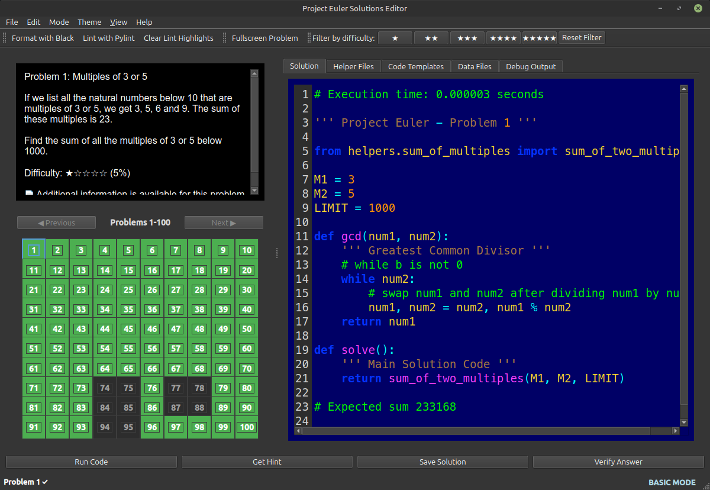

# Project Euler Solutions Editor



A comprehensive IDE designed specifically for solving and managing [Project Euler](https://projecteuler.net/) problems, with support for both basic (first 100 problems) and max (all available problems) modes.

## Features

- **Dual Mode Support**: Basic mode (100 problems) and Max mode (945 problems)
- **Problem Management**: Browse, view, and manage Project Euler problems
- **Code Editor**: Syntax highlighting, auto-completion, and line numbers
- **Code Formatting**: Format your code with Black
- **Code Linting**: Lint your code with Pylint
- **Helper Files**: Create and manage reusable code modules
- **Code Templates**: Save and reuse code templates
- **Data Files**: Access and preview problem data files
- **Solution Verification**: Verify your solutions against known answers
- **Progress Tracking**: Track your solved problems with a visual grid
- **Debugging Tools**: Debug your solutions with integrated output panel
- **Themes**: Light and dark theme support
- **Tutorials**: In-app tutorials for learning

## Installation

1. **Download the pre-built binaries** for your operating system from the [Releases](https://github.com/CFFinch62/PEIDE/releases) page on our GitHub repository.
   
2. **Extract the archive**:
   - On Windows: Extract the `.zip` file.
   - On Linux/macOS: Extract the `.tar.gz` file.

3. **Run the application**:
   - Open the extracted folder.
   - Run the `pe_editor` executable file (no installation of Python or dependencies required!).

### Building from Source (Optional)

If you prefer to run the application from source code instead of using the pre-built binaries:

1. Clone the repository:
   ```bash
   git clone https://github.com/CFFinch62/PEIDE.git
   cd PEIDE
   ```

2. Install dependencies:
   ```bash
   pip install -r requirements.txt
   ```

3. Run the application:
   ```bash
   python pe_editor.py
   ```

- Python 3.8 or higher
- PyQt6 for the user interface
- Black for code formatting
- Pylint for code linting

## Project Structure

- `pe_editor.py`: Main application entry point
- `problem_manager.py`: Manages problem data and solutions
- `run_manager.py`: Handles code execution and verification
- `progress_grid.py`: Visual grid for tracking progress
- `settings_manager.py`: Manages application settings
- `theme_manager.py`: Handles application theming
- `ui/`: UI components including code editor and panels
- `dialogs/`: Application dialogs
- `problems/`: Problem descriptions and metadata
- `solutions/`: Saved solutions
- `helpers/`: Helper modules for problem solving
- `templates/`: Code templates
- `data/`: Data files for problems
- `tutorials/`: Tutorial content

## Usage

1. **Selecting a Problem**: Use the progress grid to select a problem
2. **Writing a Solution**: Write your solution in the code editor
3. **Running Code**: Click "Run Code" to execute your solution
4. **Verifying Solutions**: Click "Verify Answer" to check your solution
5. **Managing Helper Files**: Use the Helper Files tab to create and manage helper modules
6. **Using Templates**: Use the Templates tab to save and reuse code snippets

## License

[(c) 2025 Chuck Finch - Fragillidae Software

## Acknowledgements

- Project Euler for providing the mathematical problems
- PyQt6 for the UI framework
- Black and Pylint for code quality tools 